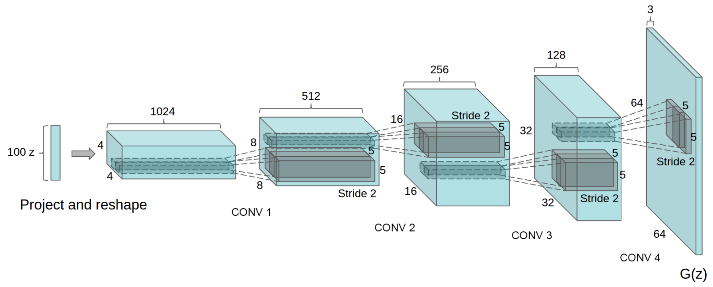

# Deep Convolutional Generative Adversarial Networks with TensorFlow & slim
##  implementation based on http://arxiv.org/abs/1511.06434
  "Unsupervised Representation Learning with
  Deep Convolutional Generative Adversarial Networks",
  Alec Radford, Luke Metz and Soumith Chintala

## Network architecture


## Requirements
* TensorFlow 1.1.0 or greater(?)
* opencv (for generate.py)
* numpy

## Training
### dataset download (celebA_tfrecords.zip)
* [celebA tfrecords](https://www.dropbox.com/s/vd0nuybgvo9uvx0/celebA_tfrecords.zip?dl=1)
    
### editing dcgan_train.sh
* Set the "WORKING_DIR path" to path you want
* Set the dataset path or move to where dcgan/datasets/celebA/tfrecords
* Set the hyper-parameters

#### dcgan_train.sh
```shell
# Working directory
WORKING_DIR=$HOME/projects

# Where the training (fine-tuned) checkpoint and logs will be saved to.
TRAIN_DIR=$WORKING_DIR/dcgan.tensorflow/exp1

# Where the dataset is saved to.
DATASET_DIR=$WORKING_DIR/datasets/celebA/tfrecords

CUDA_VISIBLE_DEVICES=0 \
python train.py \
    --train_dir=${TRAIN_DIR} \
    --dataset_dir=${DATASET_DIR} \
    --initial_learning_rate=0.0002 \
    --num_epochs_per_decay=5 \
    --learning_rate_decay_factor=0.9 \
    --batch_size=128 \
    --num_examples=202599 \
    --max_steps=30000 \
    --save_steps=2000 \
    --adam_beta1=0.5 \
```

### run dcgan_train.sh
```shell
$ ./dcgan_train.sh
```
* You can use `tensorboard` for monitoring loss and generated images
```shell
$ tensorboard --logdir=exp1
```

## Generating images
### generate.sh
```shell
# Working directory
WORKING_DIR=$HOME/projects

# Where the training (fine-tuned) checkpoint and logs will be saved to.
TRAIN_DIR=$WORKING_DIR/dcgan.tensorflow/exp1

batch=$1

#CUDA_VISIBLE_DEVICES=0 \
python generate.py \
    --checkpoint_path=${TRAIN_DIR} \
    --checkpoint_step=-1 \
    --batch_size=$batch \
    --seed=12345 \
    --make_gif=False \
    --save_step=2000 \

convert -delay 20 -loop 0 *.jpg generated_images.gif
```

### run generate.sh
```shell
$ ./generate.sh batch_size (the number of images you want)
```
* If the `make_gif` flag is True (`--make_gif=True`) then you will get generated images in each step.
* And `convert` command make one gif file from generated images.

## Results
### celebA datasets


## Author
  Il Gu Yi
